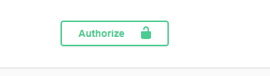
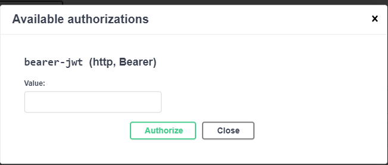

# Sistema para administrar Productos y Pedidos.

## Descripción

Este proyecto es una API REST desarrollada para gestionar productos y pedidos. Incluye funcionalidades CRUD, autenticación y autorización mediante JWT, y está documentado con Swagger.

## Tecnologías Utilizadas

- Bases de datos: MySQL (Desplegada en RAILWAY)
- Spring Boot
- Java 11
- Spring Security
- Spring Data JPA
- Librerias: Lombok, MapStruct, Validation
- JWT
- Swagger
- GitHub
- Apache Poi
- Docker

## Implementaciones que se realizaron

- Cruds de Productos y Pedidos.
- Implementación de Búsqueda y Filtrado.
- Paginación y Ordenamiento.
- Autenticación y Autorización.
- Validaciones (`todos los endpoints estarán validados`).
- Relaciones entre Entidades.
- Manejo de Errores y Logging.
- Documentación API `swagger`.
- Diseño y Patrones de Arquitectura.

## Implementaciones adicionales
- Uso de `MapStruct` para mapear entidades a DTOs.
- Uso de `Lombok` para reducir la cantidad de código.
- Manejo de `constantes` en una clase de utilidad.
- Exportacion de productos a un archivo `PDF`.
- Implementación de `excepciones` personalizadas.
- Implementación de eliminación lógica.
- Uso de Dto's.

## Despliegue en Render

La API está desplegada en Render y se puede acceder a través de la siguiente URL:

- [Swagger UI](https://retocp2024-fqf0.onrender.com/swagger-ui/index.html)
  `https://retocp2024-fqf0.onrender.com/swagger-ui/index.html`
## Documentación de la API

La documentación completa de la API está disponible en Swagger. Puedes utilizar Swagger para probar todos los endpoints disponibles en la API.

## Pasos para Usar la API

### 1. Acceder a Swagger UI

Visita la siguiente URL para acceder a Swagger UI:

- [Swagger UI](https://retocp2024-fqf0.onrender.com/swagger-ui/index.html)
  `https://retocp2024-fqf0.onrender.com/swagger-ui/index.html`
### 2. Crear un Nuevo Usuario

Para crear un nuevo usuario, utiliza el endpoint `POST /api/auth/nuevo`. Proporciona la información requerida para registrar un nuevo usuario.

1. Haz clic en el endpoint `POST /api/auth/nuevo`.
2. Cree un nuevo usuario proporcionando la información requerida.

### 3. Iniciar Sesión

Para iniciar sesión y obtener un token JWT, utiliza el endpoint `POST /api/auth/login`.

1. Haz clic en el endpoint `POST /api/auth/login`.
2. Logueate con el usuario creado anteriormente.
3. Copia bien el token `JWT` generado y pegalo en el candado de `Authorize`.
   
### 4. Autenticación con el Token JWT

Para acceder a los endpoints protegidos, debes proporcionar el token JWT.

1. Haz clic en el botón `Authorize` en la parte superior derecha de Swagger UI.
 

        
    

2. En el campo `Value`, pega el token JWT copiado anteriormente.

        
    

3. Haz clic en `Authorize` y luego en `Close`.
4. Realizado esto, ya puedes acceder a todos los endpoints protegidos.

#### GRACIAS.

